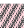

# beadplane
Create a SVG file of a hexagonal layouts of beads from a simpel bead crochet bracelet pattern

Designing patterns for a bead crochet bracelet can be very hard, and this script is to help visulize a bead crochet pattern.
The script is also useful to create custom high quality images of a bead crchet pattern to include in blog posts or other websites, a personal pattern collection, etc.

## Intallation and running
* Clone the git repository onto your computer.
* Change directory to the newly added directory `beadplane/`.
* Create a `.bead` file (see bead file properties).
* Run the Python script with the following command, replacing the `<beadfilename>` with the name of the file you created (and any flag options):
```
python3 beadplane.py <beadfilename>.bead
```
* The script will produce a file in the same directory called `<beadfilename>.svg`.
You can open a SVG file in any of your favourite browsers (e.g. by running `firefox <beadfilename>.svg`)

## Options
The script includes the following options, which can also be show by running `python3 beadplane.py -h`.

| Flags             | Options              | Description                                                                                               |
|-------------------|----------------------|-----------------------------------------------------------------------------------------------------------|
| `-h`, `--help`    |                      | Show help message.                                                                                        |
| `-s`, `--size`    | `small`              | Create small bead plane. Width is three times the number of beads in a round.                             |
|                   | `medium`             | Create medium bead plane (deafault). Width is 24 beads.                                                   |
|                   | `large`              | Create large bead plane. Width is six times the number of beads in a round.                               |
| `-d`, `--diagram` |                      | Create SVG file of the classic bead crochet diagram. The file will be named `<beadfilename>-diagram.svg`. |
| `-p`, `--plane`   |                      | Create SVG file of the bead plane (default).                                                              |
| `-w`, `--width`   | Any positive integer | Custom height in number of beads.                                                                         |
| `-H`, `--height`  | Any positive integer | Custom height in number of beads.                                                                         |

If the `-d` and `-p` falgs are present, then both a SVG file of the diagram and the bead plane will be created.

## Bead file properties
An example of a `.bead` file can be found in the directory `examples/`.
This is the example file `aztec-wave.bead`.
```
around = 7
color b = black
color p = pink
1b 1p 2b 1p 1b 3p 3b
1p 1b 2p 1b 1p 3b 3p
```

A `.bead` file needs three things: The length of a round (stored in `around` as an integer), a set of color codes, and lines with the pattern, written using the color codes.
A line of color code should look like this:
```
color <code> = <colorname>
```
where `<code>` is a placeholder for the character(s) you would like to use in your pattern, and where `<colorname>` is a placeholder for a color.
The color can be written in any CSS color format (e.g. color keyword `red`, hexdecimal notation `#ff0000`, or RGB function `rgb(255, 0, 0)`).

All lines without an `=` is espected to be code for the pattern, always written as an integer following a defined color code, and with each repeat seperated by a space.
If the patten code consists of multiple lines, it is read from first to last.

The bead files does not yet support comments.

## Examples
By running `python3 beadplane.py examples/aztec-wave.bead` the following image is produced.


By running `python3 beadplane.py -d examples/aztec-wave.bead` the following image is produced.


## Dependencies
* `Python3` and its standard libraries

## Acknowledgments
This project was strongly inspired by the book "Crafting Conundrums: Puzzles and Patterns for the Bead Crochet Artist" by Ellie Baker and Susan Goldstine.
Most pattern examples are from this book, and the maths needed for this projected is developed and well explained here.
